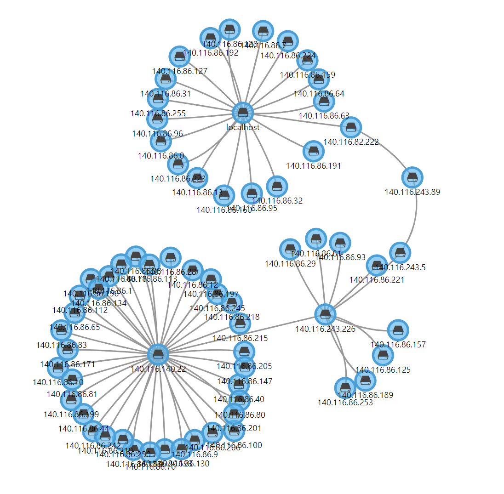

# **Network Topology Scanning and Json file Generation Tool**

## **Explanation of the network topology and traceroute files**
Our network topology JSON file will be derived from the text file generated by the `nmap` command's traceroute. This text file will be processed into a collection of information containing nodes and links.

### **Traceroute text file**

The following is the content of the traceroute text file. It contains the hop details from `127.0.0.1`, which is `localhost`, to each physical IP in the specified subnet. Each hop corresponds to a device name and an IP address.

***Text file :***

```
Starting Nmap 7.01 ( https://nmap.org ) at 2024-05-22 00:40 CST
Nmap scan report for 140.116.86.0
Host is up (0.00037s latency).

TRACEROUTE (using proto 1/icmp)
HOP RTT     ADDRESS
1   ... 4
5   0.30 ms 140.116.86.0

Nmap scan report for 140.116.86.1
Host is up (0.0031s latency).

TRACEROUTE (using proto 1/icmp)
HOP RTT      ADDRESS
1   0.25 ms  140.116.82.222
2   20.54 ms 140.116.243.89
3   10.93 ms 140.116.243.5
4   30.45 ms 140.116.243.226
5   0.56 ms  140.116.140.22
6   0.41 ms  140.116.86.1

...
```

### **Topology Json file**

The following is the structure of the information contained in the JSON file :

***Json file :***
```json
{
    "topo": {
        "nodes": [
            ...
        ],
        "portlists": [],
        "links": [
            ...
        ]
    }
}
```

The structure of a node will include several parameters. Here are descriptions of the more important ones:

```json
{
    "device_name": "140.116.86.100",
    "flag": 0,
    "gateway": "0.0.0.0",
    "id": "140.116.86.100",
    "ip": "140.116.86.100",
    "ip_on": true,
    "knmp_on": true,
    "mac": "",
    "netmask": "255.255.255.0",
    "snmp_on": true,
    "vlan": 1
}
```

* *device_name* : The name of the device (if there is no device name, it will be the IP address)
* *id* : This is the IP address of each device
* *ip* : The address"

The structure of a link will only list the connection status between IPs, as shown below."

```json
{
    "source": "127.0.0.1",
    "source_port_disp": "",
    "target": "140.116.86.100",
    "target_port_disp": ""
}
```


## **Usage**

### **Step.1** NMAP Command Installation
```bash
$ sudo apt install nmap
```
We can use nmap command to make the traceroute information for specified ip address.


***Ref*** : [How to Install Nmap on Ubuntu: A Comprehensive Guide](https://www.stationx.net/install-nmap-ubuntu/)


### **Step.2** Using python source code to generate traceroute txt file

Our source code can only accept the first three octets of an IP address range, such as `192.168.44.*`. The program will perform a traceroute from 127.0.0.1, which is localhost, to all IPs in the range 140.116.82.0-255, and record all the routes in a text file.

***Using :*** `nmap_traceroute.py`

***Command format :***
```bash
python nmap_traceroute.py <ip_mask> <txt file name>
```
***Command example :***
```bash
$ python nmap_traceroute.py 192.168.44.* nmap_output.txt
```

### **Step.3** Using python source code to generate traceroute txt file

Our source code can further convert the previously generated traceroute text file into a JSON topology file, which can be used by subsequent C components.

The topology content is pure, meaning it will only contain IP nodes and the links between them.

***Using :*** `topo_generation.py`

***Command format :***
```bash
python topo_generation.py <txt file name>
```
***Command example :***
```bash
$ python topo_generation.py nmap_output.txt
```

Therefore, the result of visualizing the expanded JSON file is shown in the figure below.

